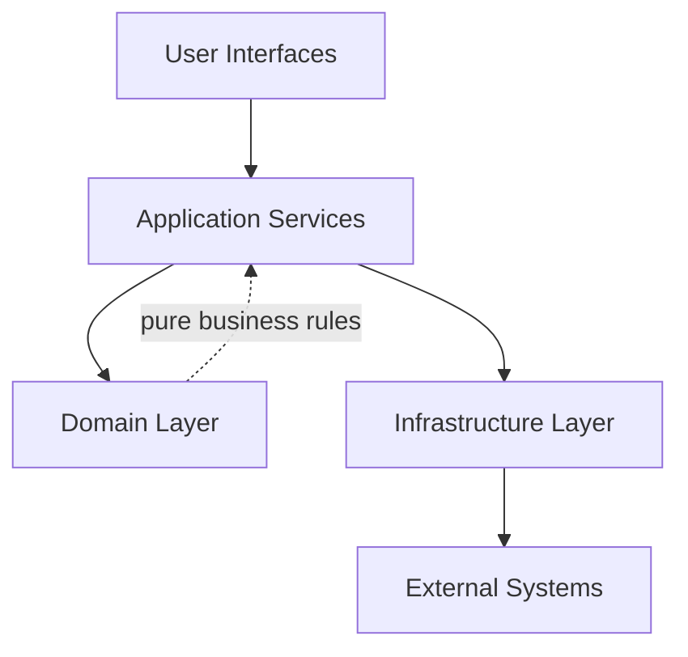

# Architecture Proposal

## Purpose

This document proposes a scalable architecture for the AI Trackflow project based on the current monorepo layout. The goal is to support:

- Fast iteration for product features.
- Clear separation between UI, domain logic, and integrations.
- Reusable assets across agents, skills, tools, and apps.
- Testability and maintainability as the codebase grows.

## Current Repository Context

The repository already includes a strong foundation:

- UI application in `uis/talent-pipeline-tracker` (Next.js + TypeScript).
- Website assets in `apps/website`.
- Agent and skill scaffolding in `agents` and `skills`.
- Shared type package in `packages/shared`.
- Documentation and workflow areas in `docs` and `workflows`.

The architecture below builds on this structure rather than replacing it.

## Proposed High-Level Architecture

Use a modular monorepo with layered boundaries inside each product area.

### Layers

1. User Interfaces
- Next.js frontend under `uis/talent-pipeline-tracker`.
- Lightweight website pages under `apps/website`.
- Responsibilities: rendering, interaction handling, client-side state, accessibility.

2. Application Services
- Orchestration of use cases and workflow steps.
- Responsibilities: transaction/use-case coordination, DTO mapping, validation handoff, API composition.

3. Domain Layer
- Core entities and business rules (candidate lifecycle, notes, statuses, scoring logic).
- Responsibilities: pure logic, invariants, policy checks.
- No framework or transport dependencies.

4. Infrastructure Layer
- API clients, persistence adapters, and external integrations (LLMs, third-party services).
- Responsibilities: HTTP calls, serialization, retries, observability plumbing.

## Suggested Module Boundaries

### Frontend App (`uis/talent-pipeline-tracker`)

Target internal structure:

- `app/`: routes and server/client page composition.
- `components/`: presentational and composed UI components.
- `features/`: feature-oriented modules (candidate profile, notes timeline, pipeline board).
- `domain/`: business models and pure functions used by frontend.
- `services/`: app-level use case orchestration.
- `lib/`: low-level utilities and typed API client setup.
- `types/`: local transport/UI types that are not global shared contracts.

Rule of thumb:

- `components` should not call APIs directly.
- `features` can consume `services` and `domain`.
- `services` can consume `domain` + `lib`/`infrastructure`.

### Shared Package (`packages/shared`)

Use `packages/shared` as the canonical contract source for:

- Cross-app TypeScript interfaces.
- Domain enums and value objects shared across systems.
- Request/response schemas for API boundaries.

Prefer generating or validating runtime schemas where needed (for example with Zod) to avoid type drift.

### Agents and Skills

- `agents/`: autonomous or semi-autonomous runtime agents.
- `skills/`: composable capabilities with constrained scope and predictable I/O.

Contract model:

- Define skill input/output contracts in `packages/shared`.
- Keep side effects isolated in adapters under each skill/agent.
- Add examples and tests near each skill/agent template.

## Data Flow Proposal

### UI Request Flow

1. UI event triggers a feature action.
2. Feature calls an application service.
3. Service validates/transforms payload and invokes infrastructure adapter.
4. Adapter calls backend/API.
5. Response maps to domain/view models.
6. UI renders state transitions (`idle`, `loading`, `success`, `error`).

### Agent/Skill Execution Flow

1. Entry point receives structured input.
2. Input validated against shared schema.
3. Domain logic executes deterministic steps.
4. External calls done via tool adapters.
5. Structured output emitted with trace metadata.

## API and Backend Direction

Current repository includes `server.py`; proposed evolution:

- Expose a versioned API surface (`/api/v1/...`).
- Keep route handlers thin; move logic to service modules.
- Add adapter interfaces for storage and LLM providers.
- Introduce request/response schema validation.

If backend expands, consider splitting into:

- `apps/api` for HTTP server.
- `packages/domain` and `packages/application` for reusable core logic.

## State Management Guidelines

For Next.js UI:

- Server state: use request-level fetching and cache strategy appropriate to route needs.
- Client state: keep local where possible; centralize only cross-route or global concerns.
- Async state shape should follow existing pattern in `types/async-state.ts`.

Recommended standard async state fields:

- `status`: `idle | loading | success | error`
- `data`
- `error`
- `lastUpdatedAt`

## Error Handling and Observability

Standardize on:

- Structured error types in domain/application layers.
- User-safe messages in UI; technical details only in logs.
- Correlation ID propagation across request boundaries.
- Basic telemetry events for key actions:
  - Candidate viewed
  - Candidate stage changed
  - Note added
  - Agent run started/completed/failed

## Security and Compliance Basics

- Validate all external input at boundaries.
- Do not log secrets or sensitive candidate data.
- Use environment-based configuration; no credentials in source.
- Add explicit CORS and rate-limiting strategy when API is public.

## Testing Strategy

Testing pyramid for this repo:

1. Unit tests
- Domain functions and service logic.
- Fast, deterministic, no network.

2. Integration tests
- API routes with adapter fakes/mocks.
- Skill and agent execution with controlled fixtures.

3. End-to-end tests
- Critical UI journeys (pipeline navigation, candidate detail, notes flow).

Coverage priorities:

- Candidate stage transitions.
- Notes CRUD behavior.
- Error and loading states.
- Shared contract compatibility.

## CI/CD Proposal

Minimum pipeline per PR:

1. Install dependencies.
2. Lint.
3. Type-check.
4. Unit + integration tests.
5. Build UI app.

Deployment gates:

- Block merge on failed quality checks.
- Run E2E on main branch and release branches.

## Naming and Conventions

- Prefer feature-first module naming over technical naming.
- Keep files small and cohesive.
- One primary responsibility per service/module.
- Use shared contracts instead of duplicate local interfaces across packages.

## Incremental Implementation Plan

### Phase 1: Boundary Clarity (1-2 sprints)

- Define and document layer responsibilities in each major area.
- Introduce `features/` and `domain/` folders in the UI app.
- Move direct API calls out of components into service modules.

### Phase 2: Shared Contracts (1 sprint)

- Expand `packages/shared` with candidate, note, and pipeline contracts.
- Add runtime validation where external inputs enter the system.

### Phase 3: Reliability and Observability (1 sprint)

- Standardize error model and logging format.
- Add request correlation IDs and key telemetry events.

### Phase 4: Automated Quality (1 sprint)

- Strengthen test suites across UI, API, and skills.
- Enforce CI quality gates with branch protection.

## Risks and Mitigations

- Risk: Architecture drift from quick feature additions.
  - Mitigation: PR checklist includes boundary validation.

- Risk: Type mismatch between frontend and backend.
  - Mitigation: Shared contracts + schema validation tests.

- Risk: Growing agent complexity without clear contracts.
  - Mitigation: Skill I/O schemas and adapter isolation.

## Decision Summary

Recommended direction:

- Keep the monorepo.
- Enforce layered architecture inside each product area.
- Centralize shared contracts.
- Treat agents/skills as contract-driven modules.
- Invest early in tests and observability to reduce scaling risk.

This proposal is designed to be adopted incrementally, with immediate benefits after Phase 1 and compounding reliability gains in subsequent phases.
